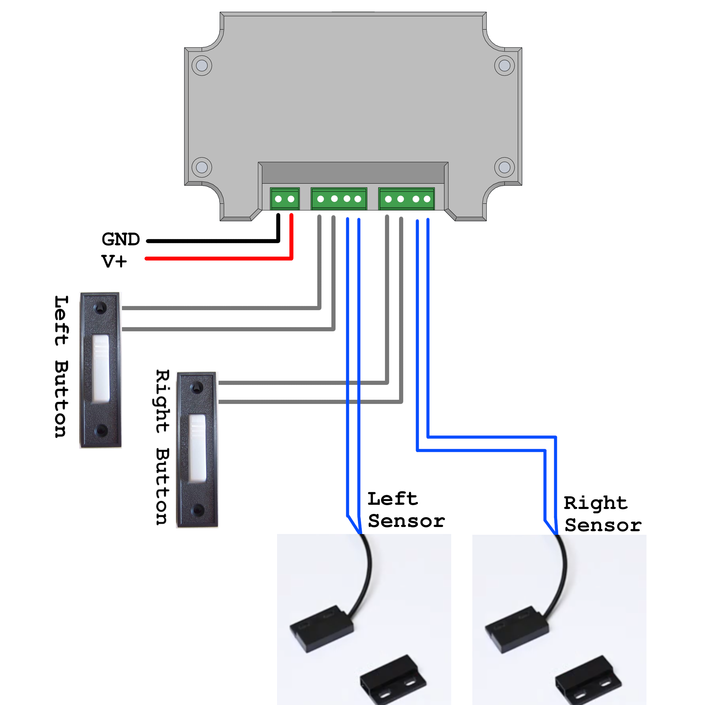
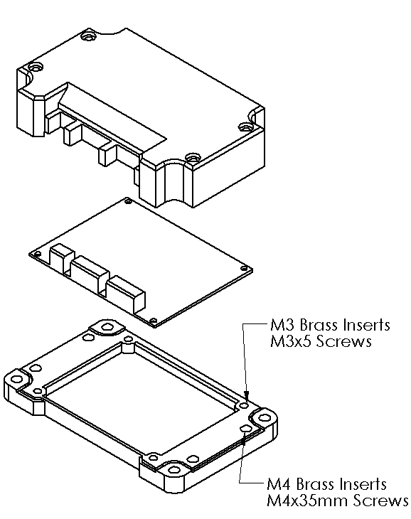

### ESPHome Garage Door Controller

I am a forgetful man. I forget to close the garage door. My wife gets frustrated that I forget to close the garage door. I may or may not get slightly banned from the garage due to leaving the garage door open too many times after leaving for work. So, I do what any sensible man would do. I offload my responsibilities to technology, of course.

The device uses an ESP8266 running ESPHome to connect to HomeAssistant and do garage door things. I used a hall effect sensor to detect if each door was open or closed, but you could use any contact that opens/closes depending on the state of the door. To open and close the doors, I just wired in a relay in parallel with each button. YMMV, but for mine this did mean I had to physically disassemble each button and solder extra wires onto the PCB.

This project was designed to be cheap, as opposed to involved. You can build your own buck converters into your projects (I have in the past), but at the end of the day it's still cheaper to buy one of those cheap adjustable converters on aliexpress and call it a day. Sure there's 0.4V of switching noise, but the D1 Mini has a built in LDO anyway, as do most cheap development boards. ¯\\\_(ツ)\_/¯ A good project is one that is finished to spec, and my spec is that it works.

### Mechanical Assembly and Bill of Materials

.step files for a 3D printed enclosure are included in this project. The backplate uses M3 screws to mount the PCB, and M4 screws to attach the top. Other Non-PCB materials are as follows:

|Item | Qty|Link |
|--|--|--|
| Hall effect sensor |2| https://www.aliexpress.us/item/3256805925218267.html |
| Cabling || https://www.aliexpress.us/item/3256806428440404.html |
|Wire Ferrules (for crimping ends) || https://www.aliexpress.us/item/3256805075641713.html |
| Lever-nut connectors (love these) || https://www.aliexpress.us/item/3256803684080411.html |
| M3 Brass Inserts | 4 | https://www.aliexpress.us/item/3256803396040989.html |
| M3x5mm |4||
| M4 Brass Inserts | 4 | https://www.aliexpress.us/item/3256803396040989.html |
| M4x35mm |4||

### Manufacturing the PCB

If you want to make this PCB yourself, simply zip up the outputs folder and upload it to the PCB manufacturer of your choice. You can take the bill of materials CSV and upload it directly to digikey to create a cart with the needed components. Anything that doesn't have a digikey part number, I listed the relevant aliexpress product page.

### Random notes for myself

Reminder: Set switches to pins 5 and 4 to prevent them from toggling during startup. (esp8266s are weird. Never before have I had to deal with GPIOs just doing random things during the startup process.)

https://community.home-assistant.io/t/esp8266-relay-active-low-how-to-prevent-triggering-on-boot-or-reset-solved/88279/30
https://rabbithole.wwwdotorg.org/2017/03/28/esp8266-gpio.html

